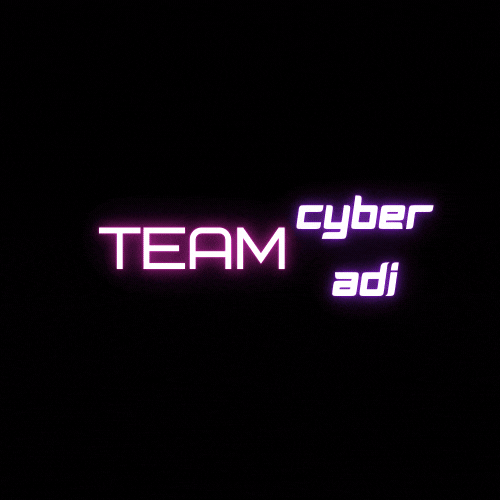

<h1 align="center">Hi 👋, I'm Cyber-Adi</h1>

  

  

<h3 align="center">'''A passionate frontend developer and Software Developer from India'''</h3>

  

  

  

  

- 🌱 I’m currently learning about **Cyber Security**

- 👨‍💻 All of my projects are available at [https://github.com/aditya12-cyber](https://github.com/aditya12-cyber)

- 💬 Ask me about **Java and some penetration testing tools**

- 📫 How to reach me **https://github.com/aditya12-cyber**

- ⚡ Fun fact **I think I would learn everything**

<h3 align="left">Connect with me:</h3>

<h3 align="left">Preview my <em>Frontend Project</em></h3>

<h4 align="center">And</h4>

  

 

<h3 align="left">Languages and Tools:</h3>
 

   
  <strong>Bash language for Shell Scripting in linux</strong>
   
   
   
  <strong>Bootstrap for making frontend development easy</strong>
   
  
   
  <strong>Css means Cascading style cast for styling HTML elements</strong>
   
   
   
  <strong>HTML means hyper text markup language for web development</strong>
   
    </a>
   
  <strong>Javascript for frontend as well as for backend and a i know a few about that language</strong>
   
  
   
  <strong>I know more than a little about linux and i like very much using it ..</strong>
   
   
   
  <strong>PHP means HYPERTEXT PRE-PROCESSOR for  both frontend and Backend</strong>
   
   
   
  <strong>Python is my favourite language for making tools for linux </strong>
   
   

   
 

  

  

  

  

